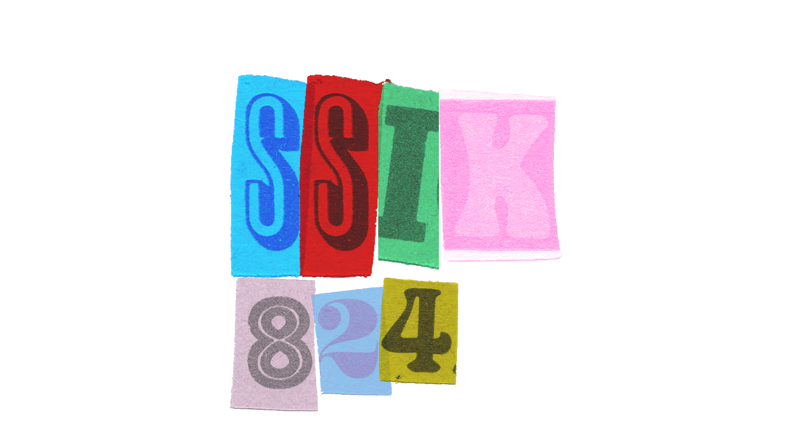

## :sparkles: Sobre Mim:

   Olá, me chamo Victor Kiss, mas pode me chamar de ssik! Sou desenvolvedor web, ui / ux e um apaixonado por tecnologia! Crio projetos desde html, css e js até projetos mais completos com React.js, Next.js styled-components dentre outras tecnologias.

## :computer:  Skills: 

   <b>Linguagens:</b> <strong>JavaScript (Node js), PHP e Python </strong>

   <b>Linguagens de Marcação:</b> <strong>Html e MarkDown</strong>

   <b>Estilo: </b> <strong>CSS, Bootstrap, Tailwind CSS, Styled-Components</strong>

   <b>Ferramentas:</b> <strong>Visual Studio Code, Vercel Deployment, Google Analytics, Google Search Console, Git, GitHub.</strong>

   Para posts relacionados a programação e mais informações sobre mim, visite meu website <a href="https://devssik.com.br" rel="noreferrer" target="_blank"> clicando aqui</a> !

